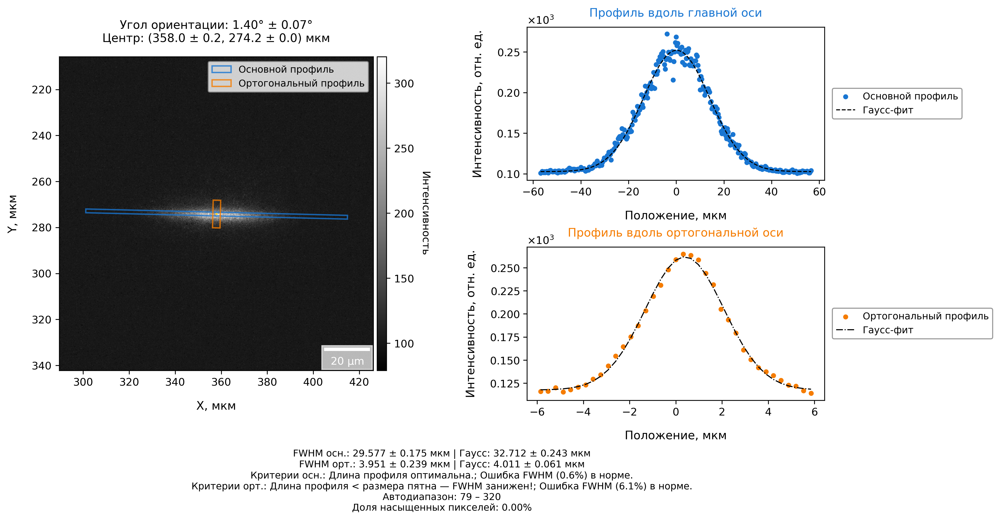
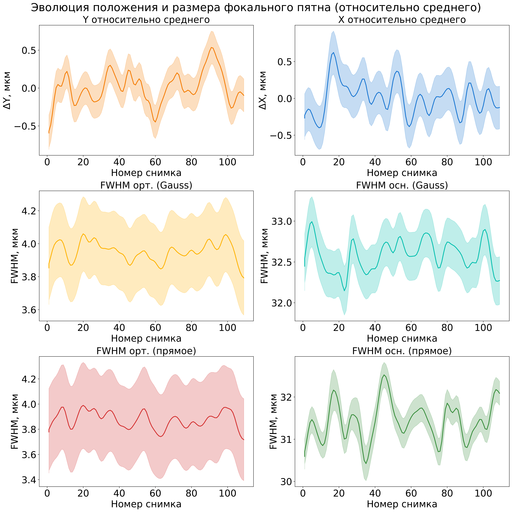

Automated Synchrotron Beam Stability Analysis

This project presents a robust and automated tool for analyzing and visualizing synchrotron beam stability data. Developed specifically for processing image series from the RKFM station at the KISI Kurchatov Synchrotron, this program is an essential asset for scientific and engineering applications that require precise, long-term monitoring of a focused beam's position and size.

Key Features:

Automated Image Processing: The tool efficiently loads and processes a series of images (e.g., PNG, JPG, TIF), automatically detecting the beam spot region using adaptive thresholding techniques.

Beam Parameter Calculation: It accurately calculates the beam spot's centroid and orientation, along with their associated uncertainties. The program also determines the Full Width at Half Maximum (FWHM) of the beam's intensity profiles using both a direct interpolation method and a more precise Gaussian fit.

Data Visualization: The software generates detailed, publication-ready plots that illustrate the evolution of the beam's key parameters, such as the change in position (
DeltaX,
DeltaY) and size (FWHM) over time.

Comprehensive Reporting: All calculated parameters, statistical summaries, and trends are meticulously saved into a single CSV file, providing a complete and organized record of the stability analysis.

This tool is built on Python and utilizes powerful libraries such as Numpy, SciPy, Pandas, and Matplotlib to ensure reliable data processing and high-quality visualization. It serves as a strong portfolio piece, demonstrating the application of programming and data science principles to solve complex problems within a high-tech scientific environment.

Scripts Overview

X-Beam_Stability_Analysis_2.py: This script is the core engine for image processing. Its primary function is to perform a detailed analysis of a single image or a series of images. It loads an image, identifies the beam spot, calculates its centroid, orientation, and FWHM, and then saves comprehensive technical and publication-quality figures. It is ideal for the initial processing of an image series and for generating a summary CSV file containing all key parameters.

X-Beam_Stability_Analysis_2_stage2.py: This script represents the "second stage" of the analysis workflow. It does not directly process images but instead uses the CSV data file generated by the first script. Its main purpose is to analyze the evolution of beam parameters (position, size, etc.) across the entire series of images. It calculates statistical summaries, centers the data relative to the mean, and generates summary plots that illustrate how the parameters have changed over time, providing a clear assessment of beam stability throughout the experiment.

Demonstration

The following images illustrate the output of the analysis scripts.

Single-Frame Analysis: A detailed report for a single image, showing the detected beam spot, extracted intensity profiles with Gaussian fits, and a summary of calculated parameters.

Evolutionary Analysis: A summary plot showing the change in the beam spot's position and size (FWHM) over a series of 100 images. This visualization is crucial for understanding long-term stability.

